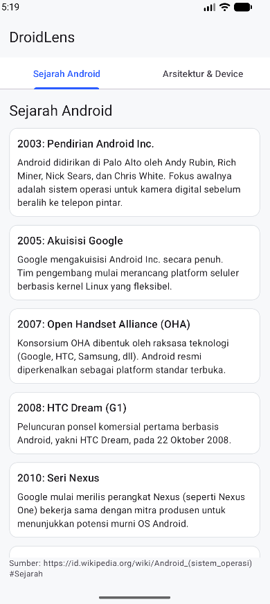
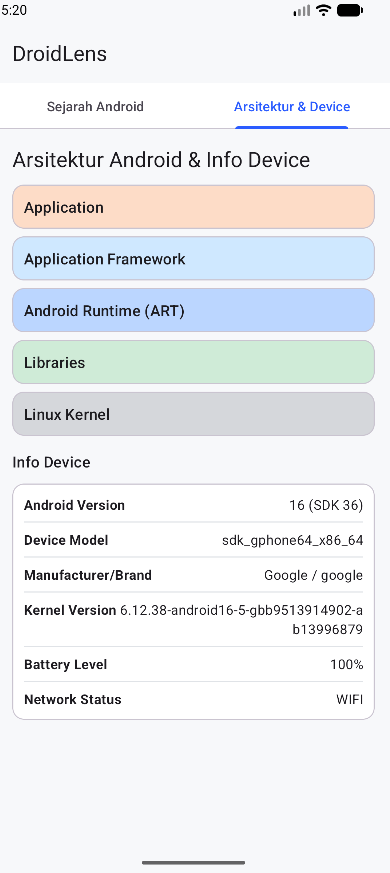

# DroidLens

DroidLens adalah aplikasi Android sederhana yang menampilkan:
- Sejarah Android
- Gambaran arsitektur Android dan informasi perangkat

## Fitur
- Navigasi tab dengan ViewPager2 + TabLayout
- Informasi perangkat: versi Android, model, manufacturer/brand, dan versi kernel
- Status baterai dan jaringan (WiFi / Seluler / Offline)

## Screens
- History tab: kartu timeline berisi sejarah penting Android
- Architecture & Info tab: ringkasan stack Android dan detail perangkat

## Screenshots

| Sejarah Android | Arsitektur & Info Device |
| --- | --- |
|  |  |

## Cara Menjalankan Aplikasi
1. Instal Android Studio versi terbaru.
2. Clone repositori ke komputer Anda:
   ```bash
   git clone https://github.com/ach-reihan/pemrograman-mobile.git
   ```
3. Buka Android Studio, pilih File > Open, lalu masuk ke folder `DroidLens`.
4. Tunggu hingga proses Gradle Sync selesai.
5. Sambungkan perangkat Android (USB Debugging aktif) atau jalankan Emulator dari Device Manager.
6. Klik tombol Run (ikon segitiga hijau) untuk menginstal dan menjalankan aplikasi.
