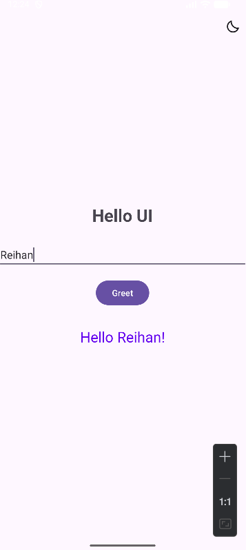
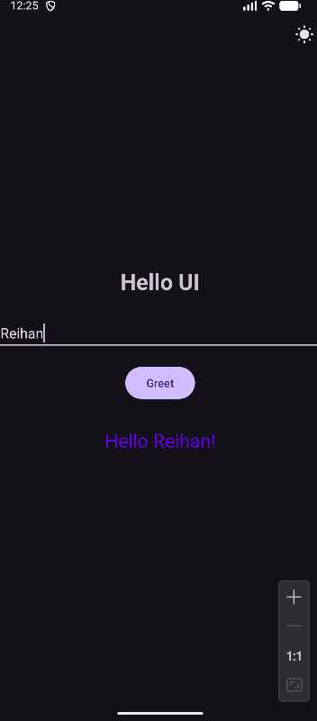

# pemrograman-mobile

## HelloUI

HelloUI adalah aplikasi Android sederhana yang memungkinkan pengguna input nama, menampilkan teks, dan mengganti tema aplikasi.

### Fitur
* **Input Teks:** Pengguna memasukkan nama.
* **Sapaan:** Menampilkan teks sapaan berdasarkan nama yang dimasukkan ("Hello {Nama}!") setelah tombol ditekan.
* **Tema Terang/Gelap:** Untuk mengubah tema aplikasi antara *Light Mode* dan *Dark Mode*.

### Tampilan Layar
*(Di bawah ini adalah tampilan aplikasi)*

|                                              Light Mode                                              |                                            Dark Mode                                             |
|:----------------------------------------------------------------------------------------------------:|:------------------------------------------------------------------------------------------------:|
| <br/> | <br/> |

### Cara Menjalankan Aplikasi

1. Menginstal **Android Studio** versi terbaru.
2. *Clone* repositori ke komputer Anda:
   ```bash
   git clone https://github.com/ach-reihan/pemrograman-mobile.git
3. Buka Android Studio, pilih **File > Open**, dan masuk ke folder HelloUI ini.
4. Tunggu hingga proses *Gradle Sync* selesai.
5. Sambungkan perangkat Android fisik Anda (dengan *USB Debugging* aktif) atau jalankan Emulator dari *Device Manager*.
6. Klik tombol **Run** (ikon segitiga hijau) di toolbar atas untuk menginstal dan menjalankan aplikasi.